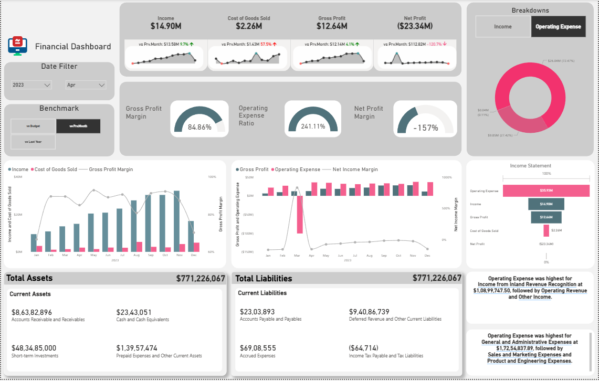
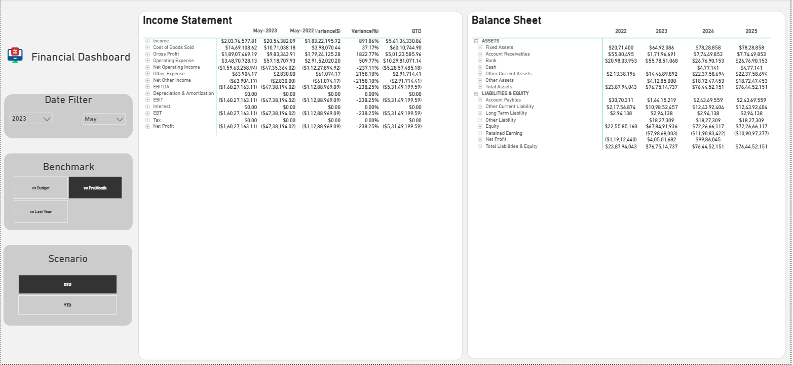
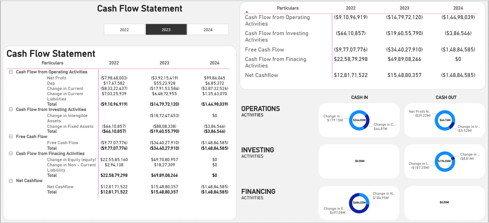
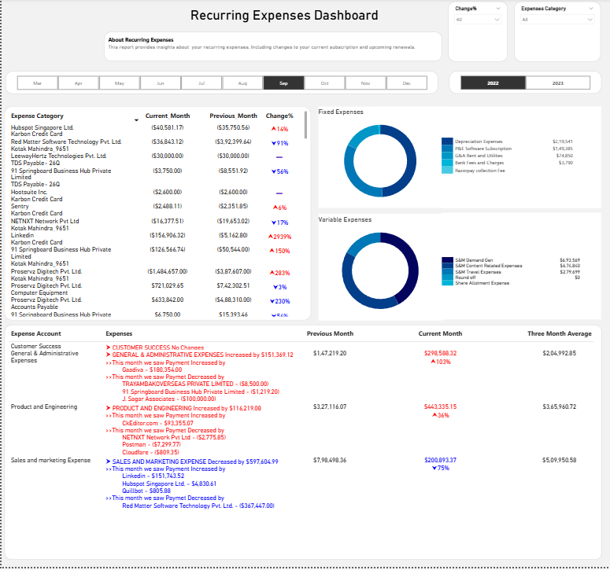
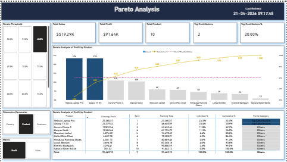

# Power BI Financial Dashboards

## 📊 Project Overview
A collection of interactive Power BI dashboards built for financial analytics, executive reporting, KPI tracking, and business decision-making.

These dashboards demonstrate my expertise in Power BI, DAX, SQL, data modeling, financial reporting, and visualization design.

---

## 🔧 Tools & Skills Used
- Power BI
- DAX
- SQL
- Power Query
- Data Modeling
- KPI Dashboarding
- Financial Analytics
- Excel

---

## 📌 Dashboards Included

### 1. Financial Executive Dashboard
Tracks Revenue, Gross Profit, Net Profit, Margin KPIs, trends, and business performance.

### 2. Cash Flow Statement Dashboard
Operating, Investing, Financing activities with yearly cash movement analysis.

### 3. Income Statement & Balance Sheet Dashboard
Year-over-year comparison, financial statement drilldowns, variance analysis.

### 4. Recurring Expense Dashboard
Tracks fixed vs variable expenses, vendor spending, monthly cost trends.

### 5. Pareto Analysis Dashboard
80/20 analysis to identify top contributors to revenue or sales.

---

## 💼 Business Impact
- Improved decision-making using executive dashboards
- Automated manual reporting processes
- Enhanced financial visibility
- Delivered actionable KPI insights

---

---

## 📸 Dashboard Screenshots

### Financial Executive Dashboard

### Income Statement & Balance Sheet

### Recurring Expense Dashboard

### Cash Flow Statement Dashboard

### Pareto Analysis Dashboard

## 👨‍💻 Author

**Santosh Kumar Mishra**  
Senior Data Analyst | Power BI Developer | SQL | Python | Financial Analytics
